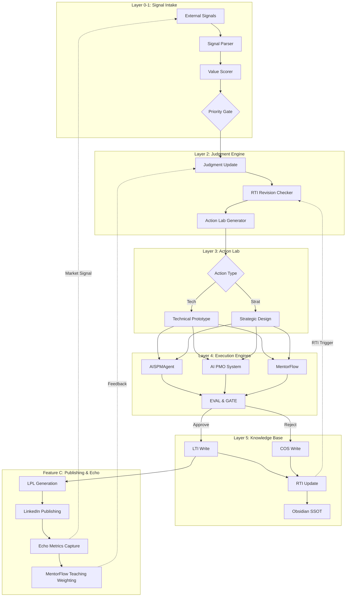
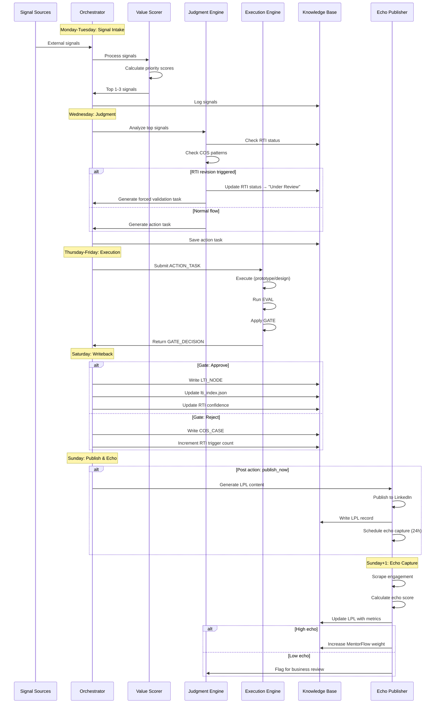

# AI-Native PM OS v3.0: Integration Architecture

**Version:** 1.0  
**Date:** 2026-02-16  
**Status:** Architecture Specification  
**Approach:** Integration-first (reuse existing implementations)

---

## Table of Contents

1. [Unified Architecture Overview](#1-unified-architecture-overview)
2. [How Each Existing Repo Maps to OS v3.0 Layers](#2-how-each-existing-repo-maps-to-os-v30-layers)
3. [New Integration Modules (Only)](#3-new-integration-modules-only)
4. [Data Contracts](#4-data-contracts)
5. [Orchestration & Event Flow](#5-orchestration--event-flow)
6. [Unified Folder Structure](#6-unified-folder-structure)
7. [Incremental Implementation Plan](#7-incremental-implementation-plan)
8. [Risks, Failure Modes, and Mitigations](#8-risks-failure-modes-and-mitigations)

---

## 1. Unified Architecture Overview

### 1.1 System Vision

AI-Native PM OS v3.0 integrates three existing systems into a **compounding judgment loop**:

```
External Signals → Value Scorer → Judgment Engine → Action Lab → 
Execution (AISPMAgent / AI PMO / MentorFlow) → Knowledge Base → 
Publishing (LPL) → Echo Metrics → Back to Signals
```

### 1.2 High-Level Architecture (Mermaid Diagram)



### 1.3 Core Principles

1. **Integration-first**: Existing repos remain **intact** with minimal changes
2. **Contract-based**: All interactions happen through versioned JSON contracts
3. **SSOT-centric**: Obsidian vault is the single source of truth for all knowledge
4. **Gradual automation**: Start manual, progressively automate proven workflows
5. **Local-first**: No cloud dependencies, all runs happen locally

---

## 2. How Each Existing Repo Maps to OS v3.0 Layers

### 2.1 AISPMAgent → Layer 4 Execution Engine (Content Pipeline)

**Current Capabilities:**
- LangGraph-based state machine: `MF → EVAL → GATE → LTI / COS`
- LTI ingestion pipeline: `SYNC → DEDUPE → ROLE_CLASSIFIER → EDITOR → ID_MAPPER → GATE → POST_PERSIST → LTI_UPDATE`
- Writes to Obsidian vault (`/mnt/user-data/uploads/` structure expected)
- Maintains `lti_index.json` and `lpl_index.jsonl`
- Decision-based gating with approve/reject routing

**Role in v3.0:**
- **Primary execution engine for content creation tasks**
- Handles: blog posts, knowledge notes, teaching content
- Input: `ACTION_TASK` with draft content
- Output: `GATE_DECISION` → `LTI_NODE` or `COS_CASE`

**Integration Points:**
```python
# Input contract from Orchestrator
{
  "task_id": "ACT-20260216-001",
  "type": "content_creation",
  "draft": "...",
  "series_hint": "LTI-6.x"
}

# Output contract to Orchestrator
{
  "task_id": "ACT-20260216-001",
  "decision": "approve|reject",
  "lti_id": "LTI-6.5",
  "lpl_id": "LPL-20260216T120000Z-001",
  "gate_score": 0.92,
  "blocking_cases": []
}
```

**Modifications Needed:**
- Add REST API wrapper around `lti_graph.py` (Flask/FastAPI)
- Accept standardized `ACTION_TASK` JSON input
- Return standardized `GATE_DECISION` JSON output
- Keep all core logic intact

---

### 2.2 AI PMO System → Layer 4 Execution Engine (Task Pipeline)

**Current Capabilities:**
- Streamlit UI for update ingestion
- Email/text parsing
- AI extraction with intent classification: `NEW / UPDATE / CLOSE`
- SQLite database with Master Board
- Safe-mode command engine with dry-run
- Executive summary generation

**Role in v3.0:**
- **Task management and project coordination**
- Handles: action tracking, project status, blockers
- Input: `ACTION_TASK` for project management actions
- Output: Task status, blocker analysis

**Integration Points:**
```python
# Input: Weekly action lab task
{
  "task_id": "ACT-20260216-002",
  "type": "task_tracking",
  "action": "create_prototype_task",
  "details": {
    "title": "Build Signal Scorer MVP",
    "project": "PM-OS-v3",
    "priority": "high",
    "deliverables": ["scorer.py", "test_data.json"]
  }
}

# Output: Execution status
{
  "task_id": "ACT-20260216-002",
  "status": "in_progress",
  "db_task_id": 42,
  "blockers": [],
  "progress_pct": 30
}
```

**Modifications Needed:**
- Add programmatic API alongside Streamlit UI
- Accept `ACTION_TASK` format
- Return structured task status
- Keep database schema intact

---

### 2.3 MentorFlow → Layer 4 Execution Engine + Feature C (Teaching)

**Current Capabilities:**
- FastAPI teaching API with lesson delivery
- RAG service with vector store
- Evaluation framework (LLM-as-judge)
- TTS integration (ElevenLabs)
- Session management
- Role-play scenarios

**Role in v3.0:**
- **Teaching content delivery** (Layer 4)
- **Knowledge → Teaching conversion** (Feature C)
- Converts validated LTI nodes into interactive lessons
- Delivers personalized teaching based on learner state

**Integration Points:**
```python
# Input: Convert LTI to lesson
{
  "action": "generate_lesson",
  "lti_id": "LTI-6.5",
  "target_audience": "junior_pm",
  "format": "interactive"
}

# Output: Lesson module
{
  "lesson_id": "chapter6_unit5",
  "content": {...},
  "quiz": [...],
  "roleplay": {...}
}

# Input: Track teaching effectiveness
{
  "action": "log_learning_event",
  "lesson_id": "chapter6_unit5",
  "user_score": 2,
  "completion_time": 480
}

# Output: Teaching analytics
{
  "lesson_id": "chapter6_unit5",
  "avg_score": 1.7,
  "avg_time": 520,
  "difficulty": "medium"
}
```

**Modifications Needed:**
- Add batch lesson generation endpoint
- Create LTI→Lesson transformer
- Add analytics aggregation endpoint
- Keep core teaching engine intact

---

## 3. New Integration Modules (Only)

### 3.1 Orchestrator Service (`pm_os_orchestrator/`)

**Responsibility:** Weekly cadence coordination and inter-engine routing

**Key Functions:**
1. **Weekly Cycle Manager**
   - Monday: Trigger signal intake
   - Wednesday: Generate action lab task
   - Thursday-Friday: Route to appropriate engine
   - Saturday: Process writebacks
   - Sunday: Publish and capture echo

2. **Engine Router**
   - Routes tasks to AISPMAgent / PMO / MentorFlow based on type
   - Manages task state across engines
   - Aggregates results

3. **Writeback Coordinator**
   - Receives `GATE_DECISION` from engines
   - Updates Obsidian vault following writeback rules
   - Maintains cross-references (LTI ↔ COS ↔ RTI ↔ LPL)

**Interface:**
```python
# orchestrator/core.py
class WeeklyCycleOrchestrator:
    def run_monday_intake(self) -> List[SIGNAL]
    def run_wednesday_judgment(self) -> ACTION_TASK
    def run_thursday_execution(self, task: ACTION_TASK) -> EVAL_REPORT
    def run_saturday_writeback(self, report: EVAL_REPORT) -> WritebackResult
    def run_sunday_publish(self) -> LPL_POST
```

**Data Storage:**
```
orchestrator/
├── data/
│   ├── signals.jsonl          # Append-only signal log
│   ├── weekly_tasks.jsonl     # Action lab task history
│   ├── gate_decisions.jsonl   # All gate decisions
│   └── metrics/
│       ├── rti_revisions.json
│       └── echo_scores.json
```

---

### 3.2 Signal Intake & Value Scorer (`signal_processor/`)

**Responsibility:** Layer 0-1 signal filtering

**Components:**
1. **Signal Collectors**
   - Manual input CLI
   - RSS feed reader (optional)
   - File watcher for capability releases (PDFs, docs)

2. **Signal Parser**
   - Extract metadata: source, type, date
   - Normalize format

3. **Value Scorer**
   - Calculate priority score: `(Strength × Confidence) / Effort`
   - Strength: Capability delta, adoption pressure
   - Confidence: Source reliability, cross-confirmation
   - Effort: Estimated execution time

**Interface:**
```python
# signal_processor/scorer.py
class ValueScorer:
    def score_signal(self, signal: SIGNAL) -> float
    def get_top_n(self, signals: List[SIGNAL], n: int = 3) -> List[SIGNAL]
```

**Output:**
```json
{
  "signal_id": "SIG-20260216-001",
  "source": "anthropic_blog",
  "type": "capability_release",
  "title": "Claude Code release",
  "priority_score": 0.85,
  "strength": 0.9,
  "confidence": 0.95,
  "effort": 60,
  "action_recommended": true
}
```

---

### 3.3 Judgment Engine (`judgment_engine/`)

**Responsibility:** Layer 2 decision-making

**Components:**
1. **Roadmap Delta Analyzer**
   - Check if signal changes priority
   - Identify non-consensus opportunities

2. **RTI Revision Trigger**
   - Monitor COS failure patterns
   - Detect "Rule of Three" (≥3 similar failures)
   - Set RTI status to "Under Review"
   - Generate forced validation tasks

3. **Action Lab Generator**
   - Create weekly task specification
   - Determine type: Technical vs Strategic
   - Define deliverables and success criteria

**Interface:**
```python
# judgment_engine/core.py
class JudgmentEngine:
    def analyze_signal_impact(self, signal: SIGNAL) -> JudgmentUpdate
    def check_rti_revision_trigger(self) -> Optional[RTI_REVISION]
    def generate_action_task(self, judgment: JudgmentUpdate) -> ACTION_TASK
```

**Data Structures:**
```python
class JudgmentUpdate(BaseModel):
    signal_id: str
    roadmap_delta: Optional[str]
    non_consensus_opportunity: bool
    rti_nodes_affected: List[str]
    action_type: Literal["tech_prototype", "strategic_design"]
```

---

### 3.4 Knowledge Base Manager (`kb_manager/`)

**Responsibility:** Layer 5 SSOT operations

**Components:**
1. **Obsidian Vault Interface**
   - Read/write operations with atomic commits
   - Index maintenance (lti_index.json, lpl_index.jsonl)
   - Cross-reference updates

2. **Writeback Rules Engine**
   - Gate Approve → LTI folder
   - Gate Reject → COS folder
   - Draft ready → LPL folder
   - Theory updated → RTI folder

3. **Index Synchronizer**
   - Keep indices in sync with vault state
   - Detect drift and reconcile
   - Generate backups

**Interface:**
```python
# kb_manager/vault_ops.py
class KnowledgeBaseManager:
    def writeback_lti(self, lti_node: LTI_NODE) -> Path
    def writeback_cos(self, cos_case: COS_CASE) -> Path
    def writeback_lpl(self, lpl_post: LPL_POST) -> Path
    def update_rti_status(self, rti_id: str, status: str) -> None
    def sync_indices(self) -> SyncResult
```

---

### 3.5 Echo Metrics Collector (`echo_metrics/`)

**Responsibility:** Feature C market feedback

**Components:**
1. **LinkedIn Engagement Scraper**
   - Capture likes, comments, shares
   - Analyze comment quality (sentiment, depth)

2. **Echo Scorer**
   - Calculate composite echo score
   - Trend analysis over time

3. **Feedback Router**
   - High echo → increase MentorFlow weighting
   - Low echo → review business viability
   - Does NOT auto-change roadmap

**Interface:**
```python
# echo_metrics/collector.py
class EchoMetricsCollector:
    def capture_post_metrics(self, lpl_id: str) -> ECHO_METRICS
    def calculate_echo_score(self, metrics: ECHO_METRICS) -> float
    def update_teaching_weight(self, lti_id: str, echo_score: float) -> None
```

---

## 4. Data Contracts

### 4.1 Contract Versioning Strategy

All contracts use semantic versioning: `vMAJOR.MINOR`
- MAJOR: Breaking changes
- MINOR: Backward-compatible additions

Contract location: `contracts/vX.Y/*.json` (JSON Schema format)

### 4.2 Core Data Contracts

#### 4.2.1 SIGNAL (v1.0)

```json
{
  "$schema": "http://json-schema.org/draft-07/schema#",
  "type": "object",
  "required": ["id", "source", "type", "timestamp"],
  "properties": {
    "id": {"type": "string", "pattern": "^SIG-[0-9]{8}-[0-9]{3}$"},
    "source": {"type": "string"},
    "type": {
      "type": "string",
      "enum": ["capability", "research", "governance", "market", "ecosystem"]
    },
    "timestamp": {"type": "string", "format": "date-time"},
    "title": {"type": "string"},
    "content": {"type": "string"},
    "url": {"type": "string", "format": "uri"},
    "priority_score": {"type": "number", "minimum": 0, "maximum": 1},
    "impact_area": {
      "type": "array",
      "items": {"type": "string"}
    },
    "linked_action_id": {"type": "string"}
  }
}
```

#### 4.2.2 ACTION_TASK (v1.0)

```json
{
  "$schema": "http://json-schema.org/draft-07/schema#",
  "type": "object",
  "required": ["id", "type", "goal", "deliverables"],
  "properties": {
    "id": {"type": "string", "pattern": "^ACT-[0-9]{8}-[0-9]{3}$"},
    "type": {
      "type": "string",
      "enum": ["tech_prototype", "strategic_design", "content_creation", "task_tracking"]
    },
    "goal": {"type": "string"},
    "context": {"type": "string"},
    "deliverables": {
      "type": "array",
      "items": {"type": "string"}
    },
    "reflection_prompts": {
      "type": "array",
      "items": {"type": "string"}
    },
    "engine": {
      "type": "string",
      "enum": ["aispm_agent", "ai_pmo", "mentorflow"]
    },
    "status": {
      "type": "string",
      "enum": ["pending", "in_progress", "completed", "blocked"]
    },
    "created_at": {"type": "string", "format": "date-time"},
    "due_date": {"type": "string", "format": "date"}
  }
}
```

#### 4.2.3 EVAL_REPORT (v1.0)

```json
{
  "$schema": "http://json-schema.org/draft-07/schema#",
  "type": "object",
  "required": ["task_id", "average_score", "decision"],
  "properties": {
    "task_id": {"type": "string"},
    "run_id": {"type": "string"},
    "average_score": {"type": "number", "minimum": 0, "maximum": 1},
    "dimension_scores": {
      "type": "object",
      "additionalProperties": {"type": "number"}
    },
    "decision": {
      "type": "string",
      "enum": ["approve", "reject", "hold"]
    },
    "blocking_cases": {
      "type": "array",
      "items": {
        "type": "object",
        "properties": {
          "dimension": {"type": "string"},
          "reason": {"type": "string"},
          "severity": {"type": "string", "enum": ["critical", "major", "minor"]}
        }
      }
    },
    "risk_level": {
      "type": "string",
      "enum": ["low", "medium", "high"]
    },
    "evaluated_at": {"type": "string", "format": "date-time"}
  }
}
```

#### 4.2.4 GATE_DECISION (v1.0)

```json
{
  "$schema": "http://json-schema.org/draft-07/schema#",
  "type": "object",
  "required": ["task_id", "decision", "destination"],
  "properties": {
    "task_id": {"type": "string"},
    "eval_report_id": {"type": "string"},
    "decision": {
      "type": "string",
      "enum": ["approve", "reject", "hold"]
    },
    "destination": {
      "type": "string",
      "enum": ["lti", "cos", "none"]
    },
    "post_action": {
      "type": "string",
      "enum": ["publish_now", "schedule", "do_not_publish", "hold"]
    },
    "canonical_decision": {
      "type": "string",
      "enum": ["merge_now", "create_now", "update_later", "no_change"]
    },
    "decision_reason": {"type": "string"},
    "decided_at": {"type": "string", "format": "date-time"}
  }
}
```

#### 4.2.5 LTI_NODE (v1.0)

```json
{
  "$schema": "http://json-schema.org/draft-07/schema#",
  "type": "object",
  "required": ["id", "title", "series", "status"],
  "properties": {
    "id": {"type": "string", "pattern": "^LTI-[0-9]\\.[0-9]+$"},
    "title": {"type": "string"},
    "series": {"type": "string"},
    "status": {
      "type": "string",
      "enum": ["active", "archived", "under_review"]
    },
    "confidence_level": {
      "type": "number",
      "minimum": 0,
      "maximum": 1
    },
    "published_at": {"type": "string", "format": "date"},
    "tags": {
      "type": "array",
      "items": {"type": "string"}
    },
    "summary": {"type": "string"},
    "linked_evidence": {
      "type": "array",
      "items": {"type": "string"}
    },
    "linked_rti": {
      "type": "array",
      "items": {"type": "string"}
    },
    "revision_history": {
      "type": "array",
      "items": {
        "type": "object",
        "properties": {
          "date": {"type": "string", "format": "date"},
          "change": {"type": "string"},
          "reason": {"type": "string"}
        }
      }
    }
  }
}
```

#### 4.2.6 COS_CASE (v1.0)

```json
{
  "$schema": "http://json-schema.org/draft-07/schema#",
  "type": "object",
  "required": ["id", "task_id", "failure_pattern_id"],
  "properties": {
    "id": {"type": "string", "pattern": "^COS-[0-9]{8}-[0-9]{3}$"},
    "task_id": {"type": "string"},
    "failure_pattern_id": {"type": "string"},
    "blocked_by_gate_reason": {"type": "string"},
    "blocking_dimension": {"type": "string"},
    "linked_rti": {
      "type": "array",
      "items": {"type": "string"}
    },
    "archived_at": {"type": "string", "format": "date-time"},
    "content": {"type": "string"},
    "analysis": {"type": "string"}
  }
}
```

#### 4.2.7 RTI_NODE (v1.0)

```json
{
  "$schema": "http://json-schema.org/draft-07/schema#",
  "type": "object",
  "required": ["id", "title", "status"],
  "properties": {
    "id": {"type": "string", "pattern": "^RTI-[0-9]\\.[0-9]+$"},
    "title": {"type": "string"},
    "category": {"type": "string"},
    "status": {
      "type": "string",
      "enum": ["active", "under_review", "deprecated"]
    },
    "confidence_level": {
      "type": "number",
      "minimum": 0,
      "maximum": 1,
      "default": 0.5
    },
    "linked_evidence": {
      "type": "array",
      "items": {"type": "string"}
    },
    "linked_lti": {
      "type": "array",
      "items": {"type": "string"}
    },
    "linked_cos_patterns": {
      "type": "array",
      "items": {"type": "string"}
    },
    "revision_trigger_count": {
      "type": "integer",
      "minimum": 0,
      "default": 0
    },
    "last_validated": {"type": "string", "format": "date"}
  }
}
```

#### 4.2.8 LPL_POST (v1.0)

```json
{
  "$schema": "http://json-schema.org/draft-07/schema#",
  "type": "object",
  "required": ["id", "source_lti_id", "content"],
  "properties": {
    "id": {"type": "string", "pattern": "^LPL-[0-9]{8}T[0-9]{6}Z-[0-9]{3}$"},
    "source_lti_id": {"type": "string"},
    "content": {"type": "string"},
    "post_url": {"type": "string", "format": "uri"},
    "published_at": {"type": "string", "format": "date-time"},
    "engagement_stats": {
      "type": "object",
      "properties": {
        "likes": {"type": "integer"},
        "comments": {"type": "integer"},
        "shares": {"type": "integer"},
        "views": {"type": "integer"}
      }
    },
    "echo_score": {
      "type": "number",
      "minimum": 0,
      "maximum": 1
    }
  }
}
```

#### 4.2.9 ECHO_METRICS (v1.0)

```json
{
  "$schema": "http://json-schema.org/draft-07/schema#",
  "type": "object",
  "required": ["lpl_id", "captured_at"],
  "properties": {
    "lpl_id": {"type": "string"},
    "captured_at": {"type": "string", "format": "date-time"},
    "engagement_rate": {"type": "number"},
    "comment_quality": {
      "type": "object",
      "properties": {
        "avg_sentiment": {"type": "number", "minimum": -1, "maximum": 1},
        "avg_depth_score": {"type": "number", "minimum": 0, "maximum": 1},
        "professional_ratio": {"type": "number", "minimum": 0, "maximum": 1}
      }
    },
    "share_velocity": {
      "type": "number",
      "description": "Shares per hour in first 24h"
    },
    "audience_breakdown": {
      "type": "object",
      "properties": {
        "by_role": {"type": "object"},
        "by_industry": {"type": "object"}
      }
    },
    "composite_echo_score": {
      "type": "number",
      "minimum": 0,
      "maximum": 1
    }
  }
}
```

---

## 5. Orchestration & Event Flow

### 5.1 Weekly Operating Rhythm (Detailed Flow)



### 5.2 Writeback Rules Matrix

| Event | Primary Destination | Secondary Actions | Index Updates |
|-------|-------------------|------------------|---------------|
| Gate Approve (LTI path) | `02_LTI/{series}/{id}.md` | Update RTI confidence | `lti_index.json` |
| Gate Reject (COS path) | `06_Archive/COS/{pattern_id}/{run_id}.md` | Increment RTI trigger count | None |
| Post publish_now | `11_LPL/{YYYY}/{MM}/{id}.md` | None | `lpl_index.jsonl` (append) |
| RTI status change | `01_RTI/{id}.md` (frontmatter) | Log in revision history | None |
| Theory validated | `01_RTI/{id}.md` (content) | Link to LTI evidence | None |
| MentorFlow lesson ready | `MentorFlow/lessons/{chapter}/` | None | MentorFlow index |

### 5.3 Event Triggers & Handlers

```python
# orchestrator/event_handlers.py

class EventRouter:
    def __init__(self):
        self.handlers = {
            "gate_approve": self.handle_gate_approve,
            "gate_reject": self.handle_gate_reject,
            "rti_revision_trigger": self.handle_rti_revision,
            "echo_high": self.handle_high_echo,
            "echo_low": self.handle_low_echo
        }
    
    def handle_gate_approve(self, decision: GATE_DECISION, content: str):
        # 1. Write LTI node
        lti_node = self.kb_manager.writeback_lti(decision, content)
        
        # 2. Update RTI confidence (if linked)
        if decision.linked_rti:
            self.kb_manager.update_rti_confidence(
                decision.linked_rti,
                delta=+0.05
            )
        
        # 3. Sync indices
        self.kb_manager.sync_lti_index()
        
        # 4. If post action = publish_now
        if decision.post_action == "publish_now":
            self.publisher.schedule_publish(lti_node.id)
    
    def handle_gate_reject(self, decision: GATE_DECISION, content: str):
        # 1. Write COS case
        cos_case = self.kb_manager.writeback_cos(decision, content)
        
        # 2. Check pattern matching
        pattern_id = self.pattern_matcher.identify_pattern(cos_case)
        cos_case.failure_pattern_id = pattern_id
        
        # 3. Increment RTI trigger count
        if decision.linked_rti:
            count = self.kb_manager.increment_rti_trigger(
                decision.linked_rti,
                pattern_id
            )
            
            # 4. Check Rule of Three
            if count >= 3:
                self.emit_event("rti_revision_trigger", {
                    "rti_id": decision.linked_rti,
                    "pattern_id": pattern_id,
                    "count": count
                })
    
    def handle_rti_revision(self, event_data: dict):
        # 1. Set RTI status to "Under Review"
        self.kb_manager.update_rti_status(
            event_data["rti_id"],
            "under_review"
        )
        
        # 2. Generate forced validation task for next week
        validation_task = ACTION_TASK(
            type="tech_prototype",
            goal=f"Validate RTI-{event_data['rti_id']} assumptions",
            context=f"Pattern {event_data['pattern_id']} occurred {event_data['count']} times",
            deliverables=[
                "Test results",
                "Evidence for/against current theory",
                "Proposed RTI revision"
            ]
        )
        self.kb_manager.save_forced_task(validation_task)
```

### 5.4 Data Persistence Patterns

**Append-only logs:**
- `orchestrator/data/signals.jsonl` (one signal per line)
- `orchestrator/data/weekly_tasks.jsonl` (one task per line)
- `orchestrator/data/gate_decisions.jsonl` (one decision per line)
- `11_LPL/lpl_index.jsonl` (one post per line)

**Versioned state:**
- `02_LTI/lti_index.json` (full state snapshot)
- `orchestrator/data/metrics/rti_revisions.json` (full state)

**Immutable artifacts:**
- `orchestrator/runs/{run_id}/` (complete run evidence pack)
- `06_Archive/COS/{pattern_id}/{run_id}.md` (failure archives)

---

## 6. Unified Folder Structure

### 6.1 Recommended Approach: Orchestrator + Submodules

```
pm-os-v3/                          # Root orchestrator repository
├── README.md
├── requirements.txt
├── .gitmodules
│
├── contracts/                     # Versioned JSON schemas
│   ├── v1.0/
│   │   ├── SIGNAL.schema.json
│   │   ├── ACTION_TASK.schema.json
│   │   ├── EVAL_REPORT.schema.json
│   │   ├── GATE_DECISION.schema.json
│   │   ├── LTI_NODE.schema.json
│   │   ├── COS_CASE.schema.json
│   │   ├── RTI_NODE.schema.json
│   │   ├── LPL_POST.schema.json
│   │   └── ECHO_METRICS.schema.json
│   └── v1.1/                      # Future versions
│
├── orchestrator/                  # NEW: Main orchestration code
│   ├── __init__.py
│   ├── core.py                    # WeeklyCycleOrchestrator
│   ├── event_handlers.py          # Event routing logic
│   ├── config.py                  # System configuration
│   ├── cli.py                     # Command-line interface
│   └── data/                      # Orchestrator state
│       ├── signals.jsonl
│       ├── weekly_tasks.jsonl
│       ├── gate_decisions.jsonl
│       └── metrics/
│           ├── rti_revisions.json
│           └── echo_scores.json
│
├── signal_processor/              # NEW: Layer 0-1 implementation
│   ├── __init__.py
│   ├── collectors/
│   │   ├── manual_input.py
│   │   ├── rss_reader.py
│   │   └── file_watcher.py
│   ├── parser.py
│   ├── scorer.py                  # ValueScorer
│   └── tests/
│
├── judgment_engine/               # NEW: Layer 2 implementation
│   ├── __init__.py
│   ├── core.py                    # JudgmentEngine
│   ├── roadmap_analyzer.py
│   ├── rti_revision_trigger.py    # Rule of Three logic
│   ├── action_generator.py        # ACTION_TASK creator
│   └── tests/
│
├── kb_manager/                    # NEW: Layer 5 implementation
│   ├── __init__.py
│   ├── vault_ops.py               # KnowledgeBaseManager
│   ├── writeback_rules.py         # Writeback logic
│   ├── index_sync.py              # Index maintenance
│   ├── pattern_matcher.py         # COS pattern detection
│   └── tests/
│
├── echo_metrics/                  # NEW: Feature C implementation
│   ├── __init__.py
│   ├── collector.py               # LinkedIn scraper
│   ├── scorer.py                  # Echo score calculator
│   ├── feedback_router.py         # Teaching weight adjuster
│   └── tests/
│
├── engines/                       # Git submodules (existing repos)
│   ├── aispm_agent/               # Git submodule → AISPMAgent
│   │   └── api_wrapper/           # NEW: REST API layer
│   │       ├── app.py
│   │       └── adapters.py
│   ├── ai_pmo/                    # Git submodule → ai_pmo_system
│   │   └── api/                   # NEW: Programmatic API
│   │       ├── task_api.py
│   │       └── adapters.py
│   └── mentorflow/                # Git submodule → ai_tutor
│       └── integration/           # NEW: LTI converter
│           ├── lti_to_lesson.py
│           └── analytics_api.py
│
├── obsidian_vault/                # SSOT knowledge base (mounted or symlinked)
│   ├── 01_RTI/                    # Frameworks
│   ├── 02_LTI/                    # Validated knowledge
│   │   ├── lti_index.json
│   │   ├── LTI-1.x/
│   │   ├── LTI-2.x/
│   │   └── ...
│   ├── 06_Archive/
│   │   └── COS/                   # Failures
│   │       └── {pattern_id}/
│   ├── 11_LPL/                    # LinkedIn posts
│   │   ├── lpl_index.jsonl
│   │   ├── 2026/
│   │   │   ├── 01/
│   │   │   ├── 02/
│   │   │   └── ...
│   └── 90_AgentData/              # System metadata
│
├── scripts/                       # Utility scripts
│   ├── setup_environment.sh
│   ├── run_weekly_cycle.sh
│   ├── backup_vault.sh
│   └── validate_contracts.py
│
├── tests/                         # Integration tests
│   ├── test_weekly_cycle.py
│   ├── test_writeback_flow.py
│   └── test_contract_compliance.py
│
└── docs/                          # Documentation
    ├── ARCHITECTURE.md            # This document
    ├── API_REFERENCE.md
    ├── RUNBOOK.md
    └── TROUBLESHOOTING.md
```

### 6.2 Git Submodule Configuration

```bash
# .gitmodules
[submodule "engines/aispm_agent"]
    path = engines/aispm_agent
    url = https://github.com/richardlee8433/AISPMAgent.git
    branch = main

[submodule "engines/ai_pmo"]
    path = engines/ai_pmo
    url = https://github.com/richardlee8433/ai_pmo_system.git
    branch = main

[submodule "engines/mentorflow"]
    path = engines/mentorflow
    url = https://github.com/richardlee8433/mentorflow.git
    branch = main
```

### 6.3 Configuration Management

```python
# orchestrator/config.py
from pathlib import Path
from pydantic import BaseModel

class PMOSConfig(BaseModel):
    # Paths
    vault_root: Path
    data_dir: Path = Path("orchestrator/data")
    contracts_dir: Path = Path("contracts/v1.0")
    
    # Engine configs
    aispm_agent_url: str = "http://localhost:8001"
    ai_pmo_url: str = "http://localhost:8002"
    mentorflow_url: str = "http://localhost:8003"
    
    # Scoring thresholds
    signal_priority_threshold: float = 0.6
    gate_pass_threshold: float = 0.7
    rti_revision_trigger_count: int = 3
    
    # Echo metrics
    high_echo_threshold: float = 0.7
    low_echo_threshold: float = 0.3
    
    # LinkedIn
    linkedin_api_key: str = ""
    
    @classmethod
    def load_from_env(cls):
        # Load from environment variables
        pass

# Usage
config = PMOSConfig.load_from_env()
```

---

## 7. Incremental Implementation Plan

### 7.1 Phase 1: MVP Foundation (Weeks 1-4)

**Goal:** Basic orchestration with manual execution

**Deliverables:**
1. ✅ Repository structure setup
   - Create pm-os-v3 repo
   - Add submodules for three engines
   - Set up contracts/ directory

2. ✅ Signal processor (manual mode)
   - CLI for manual signal input
   - Basic value scorer (hardcoded weights)
   - Save to signals.jsonl

3. ✅ Judgment engine (semi-auto)
   - Manual roadmap delta analysis
   - Manual action task generation
   - Save to weekly_tasks.jsonl

4. ✅ Orchestrator core (manual steps)
   - Weekly cycle runner (CLI-driven)
   - Manual routing to engines
   - Basic writeback to Obsidian

5. ✅ Knowledge base manager
   - Vault write operations
   - Index sync (lti_index.json)
   - No pattern matching yet

**Success Criteria:**
- Complete one full weekly cycle manually
- Successfully route 1 task to AISPMAgent
- Writeback 1 LTI node to vault
- All contracts validated

**Testing:**
```bash
# Week 1 test scenario
$ python orchestrator/cli.py signal add --source "manual" --title "Test signal"
$ python orchestrator/cli.py judgment analyze
$ python orchestrator/cli.py action generate
$ python orchestrator/cli.py execute --engine aispm_agent
$ python orchestrator/cli.py writeback
```

---

### 7.2 Phase 2: Automation & Integration (Weeks 5-8)

**Goal:** Semi-automated cycle with engine integration

**Deliverables:**
1. ✅ Engine API wrappers
   - REST API for AISPMAgent (Flask/FastAPI)
   - Programmatic API for AI PMO
   - LTI→Lesson converter for MentorFlow

2. ✅ Automated value scoring
   - Implement formula with tunable weights
   - Cross-confirmation from multiple sources
   - Auto-select top 3 signals

3. ✅ RTI revision trigger
   - COS pattern matcher (simple regex-based)
   - Rule of Three counter
   - Auto-update RTI status

4. ✅ Echo metrics collector (basic)
   - Manual LinkedIn metrics input
   - Basic echo score calculation
   - MentorFlow weight updates

5. ✅ Orchestrator automation
   - Scheduled weekly runs (cron/systemd timer)
   - Auto-routing based on task type
   - Email notifications for human checkpoints

**Success Criteria:**
- Run 4 consecutive weekly cycles
- Successfully trigger 1 RTI revision
- Capture echo metrics for 3 LPL posts
- Zero manual interventions except gate decisions

**Metrics to Track:**
- Gate pass rate
- Average cycle completion time
- Number of RTI revisions triggered
- LTI→LPL conversion rate

---

### 7.3 Phase 3: Intelligence & Optimization (Weeks 9-12)

**Goal:** Smart pattern detection and adaptive learning

**Deliverables:**
1. ✅ Advanced COS pattern matching
   - LLM-based failure clustering
   - Automatic pattern ID assignment
   - Cross-RTI pattern detection

2. ✅ Predictive signal scoring
   - Historical impact analysis
   - Source reliability weighting
   - Trend detection

3. ✅ Echo analytics dashboard
   - Time-series visualization
   - Engagement trend analysis
   - Audience insights

4. ✅ MentorFlow deep integration
   - Auto-generate lessons from LTI batch
   - Learning effectiveness feedback loop
   - Teaching content difficulty calibration

5. ✅ RTI confidence auto-tuning
   - Bayesian confidence updates
   - Evidence accumulation tracking
   - Deprecation recommendations

**Success Criteria:**
- Pattern matcher achieves 80%+ accuracy
- Signal scorer outperforms manual selection
- Echo metrics drive 2+ teaching adjustments
- RTI confidence reflects reality (validated against outcomes)

**Data Requirements:**
- Minimum 12 weekly cycles completed
- At least 30 gate decisions
- At least 10 LPL posts with echo data

---

### 7.4 Implementation Checkpoints

**After Each Phase:**
1. ✅ Contract validation
   - All data flows match schemas
   - No schema drift detected
   - Version compatibility verified

2. ✅ Integration test suite
   - End-to-end cycle test passes
   - Each engine responds correctly
   - Writeback consistency verified

3. ✅ Documentation update
   - API reference current
   - Runbook reflects reality
   - Troubleshooting guide expanded

4. ✅ Backup & recovery test
   - Vault backup works
   - State restoration verified
   - Disaster recovery documented

---

## 8. Risks, Failure Modes, and Mitigations

### 8.1 Integration Risks

#### Risk 1: Contract Drift

**Description:** Existing engines change their data formats, breaking contracts

**Impact:** HIGH - System stops working

**Probability:** MEDIUM

**Mitigation:**
- Pin engine versions in submodule references
- Add contract validation tests
- Implement adapter layer for version translation
- Monitor engine repos for breaking changes
- Maintain contract version migration tools

**Detection:**
```python
# tests/test_contract_compliance.py
def test_aispm_output_matches_contract():
    response = aispm_client.execute_task(sample_task)
    validate(response, GATE_DECISION_SCHEMA_V1_0)
```

---

#### Risk 2: Index Inconsistency

**Description:** lti_index.json falls out of sync with actual vault files

**Impact:** HIGH - Wrong content referenced, duplicate work

**Probability:** MEDIUM

**Mitigation:**
- Atomic write operations (write temp → rename)
- Index rebuild tool
- Daily sync verification
- Backup before every write
- Audit log for all index changes

**Detection:**
```python
# kb_manager/index_sync.py
def verify_index_integrity():
    vault_ltis = scan_vault_lti_files()
    index_ltis = load_lti_index()
    missing = vault_ltis - index_ltis
    orphaned = index_ltis - vault_ltis
    if missing or orphaned:
        raise IndexIntegrityError(missing, orphaned)
```

---

#### Risk 3: Engine Coupling

**Description:** Tight coupling between orchestrator and engine internals

**Impact:** MEDIUM - Hard to update engines independently

**Probability:** HIGH

**Mitigation:**
- Enforce contract-only communication
- No direct import of engine code
- API-first integration
- Adapter pattern for each engine
- Regular refactoring to reduce coupling

**Prevention:**
```python
# BAD: Direct coupling
from engines.aispm_agent.nodes.gate import governance_gate
result = governance_gate(state)

# GOOD: Contract-based
import requests
response = requests.post(
    f"{config.aispm_agent_url}/execute",
    json=action_task.model_dump()
)
gate_decision = GATE_DECISION.model_validate(response.json())
```

---

### 8.2 Operational Risks

#### Risk 4: Weekly Cadence Breakdown

**Description:** Fail to complete weekly cycle due to blocking issues

**Impact:** HIGH - System loses rhythm, backlog builds up

**Probability:** MEDIUM

**Mitigation:**
- Graceful degradation (skip optional steps)
- Manual override procedures
- Catch-up protocol (process multiple weeks)
- Alert system for missed checkpoints
- Documented recovery procedures

**Recovery Plan:**
1. Identify blocking step
2. Manual completion if needed
3. Resume from next step
4. Post-mortem to prevent recurrence

---

#### Risk 5: Signal Obsession Without Execution

**Description:** Spending time processing signals but not executing tasks

**Impact:** MEDIUM - Busy work without output

**Probability:** MEDIUM

**Mitigation:**
- Hard limit on signal processing time (30 min max)
- Require execution before next signal intake
- Track signal→task→output conversion rate
- Dashboard showing execution bottlenecks
- Weekly review of unexecuted tasks

**Metric:**
```python
execution_rate = completed_tasks / generated_tasks
if execution_rate < 0.7:
    alert("Too many tasks not executed")
```

---

#### Risk 6: Over-Complexity

**Description:** System becomes too complex for single maintainer

**Impact:** HIGH - Unsustainable, eventual abandonment

**Probability:** MEDIUM

**Mitigation:**
- Simplicity-first design principle
- Document every component (README in each dir)
- Automated testing to catch regressions
- Periodic simplification sprints
- "Could I restart this from scratch in 1 week?" test

**Simplicity Checklist:**
- [ ] Can explain system in 5 minutes?
- [ ] New developer can run cycle in 1 hour?
- [ ] Total codebase < 5000 LOC?
- [ ] All dependencies in requirements.txt?
- [ ] Single command to run weekly cycle?

---

### 8.3 Data Quality Risks

#### Risk 7: LinkedIn Feedback Loop Hijack

**Description:** Echo metrics start driving roadmap instead of judgment

**Impact:** MEDIUM - Loss of strategic control

**Probability:** MEDIUM

**Mitigation:**
- Echo metrics → teaching weight ONLY
- Explicit no-auto-roadmap-change rule
- Regular review of echo influence
- Cap teaching weight adjustment (max ±20%)
- Document all roadmap decisions with rationale

**Safeguard:**
```python
def update_teaching_weight(lti_id, echo_score):
    current_weight = get_teaching_weight(lti_id)
    delta = calculate_delta(echo_score)
    
    # Hard cap on adjustment
    max_delta = 0.2
    delta = max(-max_delta, min(max_delta, delta))
    
    new_weight = current_weight + delta
    set_teaching_weight(lti_id, new_weight)
    
    # Roadmap is NEVER auto-changed
    # This is policy, not code
```

---

#### Risk 8: RTI Revision Thrashing

**Description:** Constant RTI revisions preventing stable knowledge base

**Impact:** MEDIUM - Unstable foundations

**Probability:** LOW

**Mitigation:**
- Require evidence accumulation period (min 4 weeks)
- Limit revisions per RTI (max 1 per quarter)
- Mandatory validation task before revision
- Peer review for major theory changes
- Track revision velocity, alert if too high

**Policy:**
```python
def can_revise_rti(rti_id):
    last_revision = get_last_revision_date(rti_id)
    days_since = (datetime.now() - last_revision).days
    
    if days_since < 28:  # 4 weeks minimum
        return False
    
    revisions_this_quarter = count_revisions_since(
        rti_id, 
        quarter_start_date
    )
    
    if revisions_this_quarter >= 1:
        return False
    
    return True
```

---

### 8.4 Security & Privacy Risks

#### Risk 9: Sensitive Data in Public Repos

**Description:** Accidentally commit API keys or private content

**Impact:** HIGH - Security breach, IP exposure

**Probability:** LOW (with proper setup)

**Mitigation:**
- .gitignore for all config files
- Environment variables for secrets
- Pre-commit hooks to scan for keys
- Separate private vault (not in git)
- Regular secret rotation

**Pre-commit Hook:**
```bash
#!/bin/bash
# .git/hooks/pre-commit

if git diff --cached | grep -E "(ANTHROPIC_API_KEY|OPENAI_API_KEY|api_key)"; then
    echo "ERROR: Possible API key in commit!"
    exit 1
fi
```

---

### 8.5 Mitigation Priority Matrix

| Risk | Impact | Probability | Priority | Owner |
|------|--------|-------------|----------|-------|
| Contract Drift | HIGH | MEDIUM | **P0** | Orchestrator |
| Index Inconsistency | HIGH | MEDIUM | **P0** | KB Manager |
| Cadence Breakdown | HIGH | MEDIUM | **P0** | Orchestrator |
| Over-Complexity | HIGH | MEDIUM | **P1** | System |
| Engine Coupling | MEDIUM | HIGH | **P1** | Integration Layer |
| Signal Obsession | MEDIUM | MEDIUM | **P2** | Orchestrator |
| Feedback Hijack | MEDIUM | MEDIUM | **P2** | Echo Metrics |
| RTI Thrashing | MEDIUM | LOW | **P3** | Judgment Engine |
| Secret Exposure | HIGH | LOW | **P1** | DevOps |

**Priority Definitions:**
- **P0:** Address immediately, can break system
- **P1:** Address in current phase
- **P2:** Monitor, address if triggered
- **P3:** Accept risk, document workaround

---

## 9. Appendix

### 9.1 Glossary

- **SSOT:** Single Source of Truth (Obsidian vault)
- **LTI:** Learning, Trust, Iteration (success path)
- **COS:** Archive (failure path, "Correction of Strategy")
- **RTI:** Research, Theory, Insight (frameworks)
- **LPL:** LinkedIn Publishing Log
- **MF:** MentorFlow execution node
- **EVAL:** Evaluation node
- **GATE:** Governance gate node
- **PMO:** Project Management Office

### 9.2 Key Design Decisions

1. **Why Git Submodules vs Monorepo?**
   - Preserves independent evolution of engines
   - Allows versioning of engine integrations
   - Easier to contribute back to original repos
   - Clear separation of concerns

2. **Why JSON Contracts vs Protobuf/gRPC?**
   - Simpler for single-maintainer context
   - Human-readable for debugging
   - Easy schema evolution
   - No compile step needed

3. **Why Append-Only Logs vs Database?**
   - Immutable audit trail
   - Simple to backup
   - Easy to replay events
   - No ORM complexity

4. **Why Obsidian Vault vs Database for Knowledge?**
   - Already established SSOT
   - Human-readable markdown
   - Version control friendly
   - Portable across tools

### 9.3 Future Considerations (Out of Scope for v3.0)

- Multi-tenant support
- Cloud deployment
- Real-time collaboration
- External tool sync (Notion, Slack, etc.)
- Mobile app
- Voice interface
- Fully autonomous operation

---

## 10. Conclusion

This architecture provides a **pragmatic, integration-first** approach to building AI-Native PM OS v3.0. Key strengths:

1. ✅ **Reuses existing implementations** - minimal new code
2. ✅ **Clear contracts** - loose coupling, easy evolution
3. ✅ **Gradual automation** - start manual, automate proven workflows
4. ✅ **Single-maintainer sustainable** - simple, documented, testable
5. ✅ **SSOT-centric** - Obsidian vault remains authoritative

The system is designed to **compound judgment quality** through systematic execution, evaluation, and knowledge accumulation - exactly as specified in the AI-Native PM OS v3.0 vision.

**Next Steps:**
1. Review and approve this architecture
2. Set up repository structure (Phase 1, Week 1)
3. Implement signal processor MVP (Phase 1, Week 2)
4. Complete first manual weekly cycle (Phase 1, Week 4)

---

**Document Version:** 1.0  
**Last Updated:** 2026-02-16  
**Maintainer:** Richard Lee  
**Status:** Ready for Review

## Layer 1 Intake

Layer 1 intake fetches external sources (RSS, arXiv Atom API, and HTML listing pages), normalizes entries into `SIGNAL` contracts, validates each signal, deduplicates, and appends to JSONL storage.

### Run intake

```bash
python -m orchestrator.cli ingest --since-days 7 --limit-per-source 5
```

### Layer 1 Intake Writeback

```bash
python -m orchestrator.cli ingest --since-days 7 --limit-per-source 5 --vault-root <YourObsidianVaultRoot>
```

Optional flags:
- `--sources ingest/sources.yaml` (source registry path)
- `--out orchestrator/data/signals.jsonl` (append-only output file)
- `--threshold 0.6` (minimum priority score)
- `--vault-root <path>` (optional Obsidian vault writeback target)

### Output files

- `orchestrator/data/signals.jsonl`: append-only SIGNAL events (unchanged canonical intake store)
- `orchestrator/data/signals_index.json`: dedupe index for URLs/fallback hashes in intake storage
- `<vault_root>/98_Signals/YYYY/MM/<SIG-ID>.md`: time-based Obsidian note writeback for newly accepted signals
- `<vault_root>/00_Index/signal_url_index.json`: URL/fingerprint dedupe index for vault writeback

Signals are stored in time-based folders under `98_Signals`; graph-style classification remains metadata-driven via frontmatter fields rather than folder taxonomy.

### Add a source

Edit `ingest/sources.yaml` and add a new source entry with:
- `id`, `name`, `type`, `signal_type`, `weight`
- Type-specific settings:
  - `rss`: `url`
  - `arxiv`: `base_url`, `search_query`, sorting fields
  - `html_list`: `url`, `link_selector`, optional `include_pattern`
