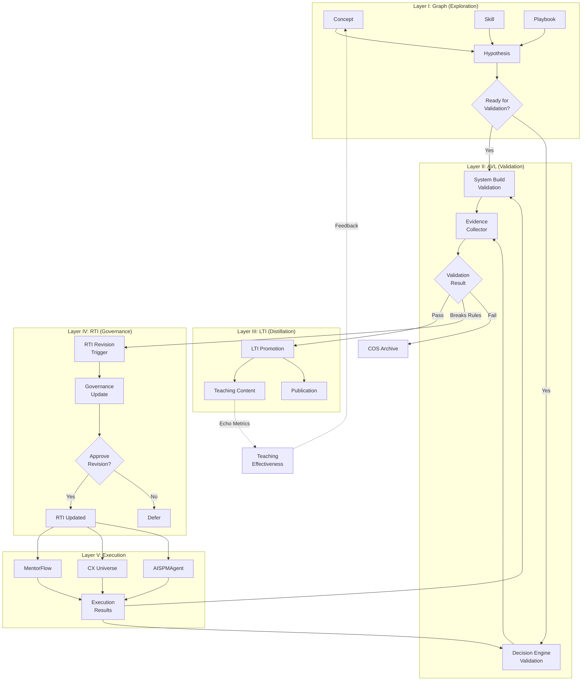
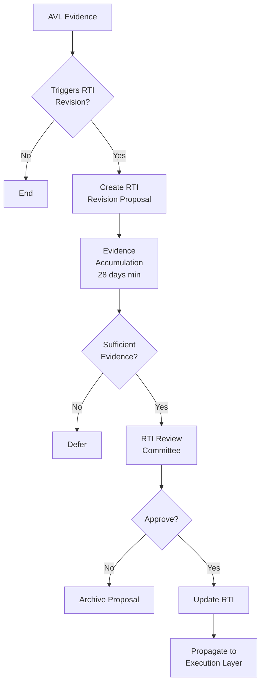

# AI-Native PM OS v4.0: Reality-Validated Operating System

**Version:** 4.0  
**Date:** 2026-02-24  
**Status:** Canonical Architecture  
**Upgrade:** Universe Root v2.0 Integration  
**Paradigm Shift:** From Integration System → Reality-Validated Capability System

---

## Executive Summary

### Core Transformation

v3.0 was an **integration architecture** — connecting existing systems through contracts.

v4.0 is a **reality-validated operating system** — where knowledge must pass through real-world pressure testing before becoming operational truth.

> **AI-Native PM OS v4.0 = Explore → Validate → Distill → Govern → Execute**

This upgrade transforms the OS from a "compounding judgment loop" into a **capability system that only promotes knowledge that has survived real decision-making consequences**.

---

## Table of Contents

1. [Architecture Philosophy](#1-architecture-philosophy)
2. [Five-Layer Operating System](#2-five-layer-operating-system)
3. [Layer Specifications](#3-layer-specifications)
4. [Validation Requirements](#4-validation-requirements)
5. [Operating Formula](#5-operating-formula)
6. [Data Contracts & Flows](#6-data-contracts--flows)
7. [Governance Rules](#7-governance-rules)
8. [Implementation Roadmap](#8-implementation-roadmap)
9. [Risk Management](#9-risk-management)

---

## 1. Architecture Philosophy

### 1.1 Fundamental Shift

**v3.0 Philosophy:**
> "Integrate systems to compound judgment"

**v4.0 Philosophy:**
> "Knowledge without real-world validation is just hypothesis. Only validated knowledge governs decisions."

### 1.2 Core Principles

1. **Reality Precedes Theory**  
   No concept becomes operational without surviving real execution pressure

2. **Validation Before Promotion**  
   Graph → AVL → LTI → RTI (never skip AVL)

3. **Experience Precedes Publication**  
   Must bear real cost/risk before teaching others

4. **Governance as Kernel**  
   RTI is not encyclopedia — it's the decision constitution

5. **Continuous Pressure Testing**  
   Every execution loop feeds back validation evidence

### 1.3 What Changed From v3.0

| Aspect | v3.0 | v4.0 |
|--------|------|------|
| **Purpose** | System integration | Capability validation |
| **Knowledge Flow** | Linear (Signal → Judgment → Execute) | Cyclical (Explore → Validate → Govern) |
| **Truth Standard** | Logical coherence | Real-world survival |
| **RTI Role** | Knowledge repository | Decision kernel |
| **Promotion Criteria** | Internal consistency | External validation |
| **Failure Mode** | Knowledge debt | Invalid governance |

---

## 2. Five-Layer Operating System

### 2.1 System Architecture

```
┌─────────────────────────────────────────────────────────────────┐
│  Layer I: Graph Layer (Knowledge Expansion)                     │
│  • Concepts, Skills, Playbooks, Hypotheses                      │
│  • Unbounded exploration, conflict allowed                      │
│  • No governance authority                                      │
└─────────────────────────────────────────────────────────────────┘
                            ↓
┌─────────────────────────────────────────────────────────────────┐
│  Layer II: Applied Validation Layer (Reality Testing)           │
│  • System Build Validation (MentorFlow)                         │
│  • Decision Engine Validation (CX Universe)                     │
│  • Produces: Evidence, Failure Patterns, Cost Data              │
└─────────────────────────────────────────────────────────────────┘
                            ↓
┌─────────────────────────────────────────────────────────────────┐
│  Layer III: LTI Layer (Distillation & Publication)              │
│  • Only validated knowledge promoted here                       │
│  • Teachable, reusable, citable                                 │
│  • External-facing knowledge products                           │
└─────────────────────────────────────────────────────────────────┘
                            ↓
┌─────────────────────────────────────────────────────────────────┐
│  Layer IV: RTI Layer (Governance Kernel)                        │
│  • Decision constitution, not encyclopedia                      │
│  • GO/NO-GO criteria, escalation rules                          │
│  • Only updates when validation breaks existing governance     │
└─────────────────────────────────────────────────────────────────┘
                            ↓
┌─────────────────────────────────────────────────────────────────┐
│  Layer V: Execution & Writeback Layer                           │
│  • MentorFlow (Build Mainline)                                  │
│  • CX Universe (Decision Engine)                                │
│  • AISPMAgent / AI PMO (Task Pipeline)                          │
│  • Feeds validation data back to AVL                            │
└─────────────────────────────────────────────────────────────────┘
```

### 2.2 Information Flow Diagram



---

## 3. Layer Specifications

### 3.1 Layer I: Graph Layer

**Purpose:** Unbounded knowledge exploration and hypothesis generation

**Components:**
- Concept nodes (definitions, frameworks)
- Skill nodes (capabilities, techniques)
- Playbook nodes (workflows, templates)
- Hypothesis nodes (untested claims)
- Evidence nodes (raw, unvalidated)

**Characteristics:**
- ✅ Infinite expansion allowed
- ✅ Conflicts and contradictions permitted
- ✅ Rapid iteration encouraged
- ❌ No governance authority
- ❌ Cannot cite in decision-making
- ❌ Not publishable externally

**Storage:**
```
graph/
├── concepts/
│   ├── concept_001.md
│   └── concept_index.json
├── skills/
│   ├── skill_001.md
│   └── skill_index.json
├── playbooks/
│   ├── playbook_001.md
│   └── playbook_index.json
├── hypotheses/
│   ├── hypothesis_001.md
│   └── hypothesis_index.json
└── evidence/
    ├── evidence_001.md
    └── evidence_index.json
```

**Data Contract:**
```json
{
  "graph_node": {
    "id": "GRAPH-CONCEPT-001",
    "type": "concept|skill|playbook|hypothesis|evidence",
    "title": "Node title",
    "content": "...",
    "created": "2026-02-24T10:00:00Z",
    "updated": "2026-02-24T15:30:00Z",
    "status": "exploring|validation_ready|validated|archived",
    "related_nodes": ["GRAPH-SKILL-005", "GRAPH-PLAYBOOK-012"],
    "validation_target": null,
    "tags": ["pm", "decision-making"]
  }
}
```

**Promotion Criteria to AVL:**
```python
def ready_for_validation(graph_node):
    checks = {
        'has_testable_claim': graph_node.has_hypothesis(),
        'has_validation_plan': graph_node.validation_target is not None,
        'sufficient_detail': len(graph_node.content) > 500,
        'linked_to_reality': graph_node.has_execution_context()
    }
    return all(checks.values())
```

---

### 3.2 Layer II: Applied Validation Layer (AVL)

**Purpose:** Reality-test Graph knowledge through real systems and decisions

**Role:** THE BRUTAL LAYER — where theory meets consequence

**Two Validation Streams:**

#### A. System Build Validation

**Validator:** MentorFlow (Teaching System)

**Tests:**
- Does the workflow actually work in production?
- Can learners execute this successfully?
- What's the actual cost/time/complexity?
- Does evaluation gate catch real failures?

**Evidence Generated:**
```json
{
  "validation_id": "VAL-MF-2026-002",
  "graph_node": "GRAPH-PLAYBOOK-012",
  "validation_type": "system_build",
  "test_date": "2026-02-24",
  "test_context": "MentorFlow lesson delivery",
  "result": "pass|fail|partial",
  "metrics": {
    "execution_success_rate": 0.85,
    "avg_completion_time": 1200,
    "error_rate": 0.15,
    "cost_per_execution": 0.23
  },
  "failure_modes": [
    "Learners confused by step 3",
    "Evaluation criteria too strict"
  ],
  "blocking_issues": [],
  "recommendation": "promote|revise|archive"
}
```

#### B. Decision Engine Validation

**Validator:** CX Universe (Real PM Decisions)

**Tests:**
- Does this escalation rule prevent real failures?
- Can drift be detected before damage?
- Does the decision framework reduce errors?
- What's the cost of false positives/negatives?

**Evidence Generated:**
```json
{
  "validation_id": "VAL-CX-2026-003",
  "graph_node": "GRAPH-CONCEPT-015",
  "validation_type": "decision_engine",
  "test_date": "2026-02-24",
  "test_context": "Escalation decision in Project X",
  "result": "pass|fail|partial",
  "decision_quality": {
    "prevented_escalations": 3,
    "missed_escalations": 1,
    "false_positives": 0,
    "time_saved_hours": 12
  },
  "failure_modes": [
    "Missed edge case: stakeholder already committed"
  ],
  "governance_impact": "triggers_rti_revision",
  "recommendation": "promote|revise|archive"
}
```

**AVL Processing Pipeline:**

```python
class AVLProcessor:
    def __init__(self):
        self.validators = {
            'system_build': MentorFlowValidator(),
            'decision_engine': CXUniverseValidator()
        }
    
    def validate_graph_node(self, graph_node):
        """
        Run validation based on node type and validation target
        """
        validator = self.validators[graph_node.validation_target]
        evidence = validator.execute_validation(graph_node)
        
        # Store evidence
        self.store_validation_evidence(evidence)
        
        # Determine promotion path
        if evidence.result == 'pass' and evidence.recommendation == 'promote':
            return PromotionDecision(
                target_layer='LTI',
                confidence=evidence.metrics.get('success_rate', 0),
                evidence_id=evidence.validation_id
            )
        elif evidence.governance_impact == 'triggers_rti_revision':
            return PromotionDecision(
                target_layer='RTI_REVIEW',
                reason=evidence.failure_modes,
                evidence_id=evidence.validation_id
            )
        else:
            return PromotionDecision(
                target_layer='GRAPH_REVISION',
                reason=evidence.failure_modes,
                evidence_id=evidence.validation_id
            )
```

**Storage:**
```
avl/
├── validation_queue/
│   └── pending_validations.jsonl
├── evidence/
│   ├── system_build/
│   │   └── VAL-MF-2026-002.json
│   └── decision_engine/
│       └── VAL-CX-2026-003.json
├── failed_validations/
│   └── failure_archive.jsonl
└── metrics/
    └── validation_stats.json
```

---

### 3.3 Layer III: LTI Layer

**Purpose:** Distilled, teachable knowledge validated by reality

**Entry Criteria:**
```python
def can_promote_to_lti(graph_node, avl_evidence):
    requirements = {
        'has_validation': avl_evidence is not None,
        'validation_passed': avl_evidence.result == 'pass',
        'sufficient_evidence': avl_evidence.test_count >= 3,
        'stable_metrics': avl_evidence.variance < 0.2,
        'no_blocking_issues': len(avl_evidence.blocking_issues) == 0,
        'cost_acceptable': avl_evidence.cost_per_execution < MAX_COST
    }
    
    return all(requirements.values())
```

**LTI Properties:**
- ✅ Teachable to others
- ✅ Citable in external content
- ✅ Reusable across contexts
- ✅ Cost/benefit validated
- ✅ Failure modes documented

**LTI Node Structure:**
```json
{
  "lti_id": "LTI-6.5",
  "title": "Escalation Decision Framework",
  "series": 6,
  "subseries": 5,
  "source_graph_nodes": ["GRAPH-CONCEPT-015", "GRAPH-PLAYBOOK-012"],
  "validation_evidence": ["VAL-CX-2026-003", "VAL-MF-2026-002"],
  "status": "active|deprecated|superseded",
  "content": {
    "summary": "...",
    "validated_claims": [...],
    "known_failure_modes": [...],
    "cost_data": {...},
    "usage_guidelines": "..."
  },
  "teaching_weight": 1.0,
  "citation_count": 0,
  "echo_metrics": {
    "linkedin_engagement": 0,
    "teaching_effectiveness": 0
  },
  "created": "2026-02-24T16:00:00Z",
  "last_validated": "2026-02-24T16:00:00Z"
}
```

**Publication Pipeline:**
```python
class LTIPublisher:
    def promote_from_avl(self, graph_node, avl_evidence):
        # Create LTI node
        lti_node = self.create_lti_node(graph_node, avl_evidence)
        
        # Generate teaching content
        teaching_content = self.generate_teaching_content(lti_node)
        
        # Prepare publication
        publication = self.prepare_publication(lti_node)
        
        # Store and index
        self.store_lti(lti_node)
        self.update_lti_index(lti_node)
        
        return lti_node
```

---

### 3.4 Layer IV: RTI Layer (Governance Kernel)

**Purpose:** Decision constitution — the rules that govern GO/NO-GO decisions

**Critical Distinction:**

RTI is **NOT** a knowledge encyclopedia.  
RTI is **ONLY** the rules you use when making irreversible decisions.

**Entry Criteria:**
```python
def triggers_rti_revision(avl_evidence):
    """
    RTI only updates when validation breaks existing governance
    """
    triggers = {
        'breaks_gate_logic': avl_evidence.contradicts_current_gate(),
        'new_escalation_pattern': avl_evidence.reveals_new_risk(),
        'cost_threshold_invalid': avl_evidence.cost_exceeded_limit(),
        'evaluation_criteria_wrong': avl_evidence.false_positive_rate > 0.1,
        'governance_gap': avl_evidence.shows_missing_rule()
    }
    
    return any(triggers.values())
```

**RTI Update Process:**



**RTI Node Structure:**
```json
{
  "rti_id": "RTI-3.4",
  "title": "Evaluation Gate Governance",
  "category": "gate_rules|escalation_rules|cost_thresholds|risk_criteria",
  "status": "active|under_review|deprecated",
  "governance_rules": {
    "gate_criteria": {
      "blocking_threshold": 0.8,
      "required_evidence": ["validation", "cost_analysis"],
      "escalation_triggers": [...]
    }
  },
  "validation_evidence": ["VAL-MF-2026-001", "VAL-CX-2026-002"],
  "last_revision": "2026-02-24T18:00:00Z",
  "revision_history": [
    {
      "date": "2025-12-15",
      "trigger": "False positive rate exceeded 15%",
      "evidence": ["VAL-MF-2025-089"],
      "change": "Lowered blocking threshold from 0.9 to 0.8"
    }
  ],
  "affected_systems": ["MentorFlow.gate", "CX.escalation"],
  "next_review_date": "2026-05-24"
}
```

**RTI Revision Limits:**
```python
class RTIGovernance:
    MAX_REVISIONS_PER_QUARTER = 1
    MIN_EVIDENCE_PERIOD_DAYS = 28
    
    def can_revise_rti(self, rti_id):
        last_revision = self.get_last_revision_date(rti_id)
        days_since = (datetime.now() - last_revision).days
        
        if days_since < self.MIN_EVIDENCE_PERIOD_DAYS:
            return False
        
        revisions_this_quarter = self.count_revisions_since(
            rti_id, 
            self.get_quarter_start()
        )
        
        if revisions_this_quarter >= self.MAX_REVISIONS_PER_QUARTER:
            return False
        
        return True
```

---

### 3.5 Layer V: Execution & Writeback Layer

**Purpose:** Operational field where validated knowledge runs and generates new evidence

**Components:**

#### A. MentorFlow (Build Mainline)
- Delivers teaching based on LTI content
- Evaluates learner performance using RTI rules
- Generates system build validation evidence

#### B. CX Universe (Decision Engine)
- Applies RTI rules to real escalation decisions
- Tracks drift and decision quality
- Generates decision engine validation evidence

#### C. AISPMAgent (Content Pipeline)
- Processes LTI content into publications
- Manages gate decisions using RTI rules
- Tracks publication echo metrics

#### D. AI PMO (Task Pipeline)
- Executes action lab tasks
- Tracks project health and blockers
- Generates operational evidence

**Writeback Contract:**
```json
{
  "execution_id": "EXEC-2026-024",
  "system": "mentorflow|cx_universe|aispm_agent|ai_pmo",
  "timestamp": "2026-02-24T20:00:00Z",
  "execution_type": "teaching|decision|publication|task",
  "rti_rules_applied": ["RTI-3.4", "RTI-5.2"],
  "lti_content_used": ["LTI-6.5"],
  "result": {
    "success": true,
    "metrics": {...},
    "anomalies": [],
    "rule_violations": []
  },
  "validation_evidence": {
    "for_avl": true,
    "evidence_type": "system_build|decision_engine",
    "quality_score": 0.92
  },
  "writeback_target": "graph|avl|lti|rti"
}
```

**Writeback Router:**
```python
class WritebackRouter:
    def route_execution_result(self, execution_result):
        if execution_result.has_anomaly():
            # Potential RTI revision trigger
            self.notify_rti_review(execution_result)
        
        if execution_result.validates_graph_node():
            # Promote to AVL evidence
            self.store_avl_evidence(execution_result)
        
        if execution_result.has_teaching_metrics():
            # Update LTI teaching weight
            self.update_lti_metrics(execution_result)
        
        if execution_result.has_echo_data():
            # Store external feedback
            self.store_echo_metrics(execution_result)
```

---

## 4. Validation Requirements

### 4.1 Graph → AVL Validation Gates

**Minimum Requirements:**
- [ ] Node has testable hypothesis
- [ ] Validation plan defined (system_build OR decision_engine)
- [ ] Sufficient detail for execution (>500 words)
- [ ] Linked to real execution context
- [ ] Resource cost estimated

**Validation Plan Template:**
```markdown
## Validation Plan for GRAPH-PLAYBOOK-012

**Hypothesis:**
Using this escalation framework reduces missed escalations by >30%

**Validation Method:** Decision Engine (CX Universe)

**Test Scenarios:**
1. Project with stakeholder drift (3 instances)
2. Technical blocker requiring exec involvement (2 instances)
3. False positive test (deliberate non-escalation) (2 instances)

**Success Criteria:**
- Detection rate >85%
- False positive rate <10%
- Time to decision <2 hours
- Cost per decision <$5

**Timeline:** 4 weeks
**Resource:** 8 real project decisions
```

### 4.2 AVL → LTI Promotion Gates

**Automatic Promotion IF:**
```python
pass_criteria = {
    'validation_count': evidence.test_count >= 3,
    'success_rate': evidence.success_rate >= 0.85,
    'variance': evidence.variance < 0.2,
    'no_blockers': len(evidence.blocking_issues) == 0,
    'cost_ok': evidence.avg_cost < MAX_COST_THRESHOLD,
    'time_ok': evidence.avg_time < MAX_TIME_THRESHOLD
}
```

**Manual Review IF:**
```python
review_criteria = {
    'partial_success': 0.7 <= evidence.success_rate < 0.85,
    'high_variance': evidence.variance >= 0.2,
    'minor_blockers': 0 < len(evidence.blocking_issues) <= 2,
    'cost_borderline': evidence.avg_cost >= MAX_COST_THRESHOLD * 0.9
}
```

### 4.3 AVL → RTI Escalation Gates

**Mandatory Escalation IF:**
```python
rti_triggers = {
    'gate_logic_broken': evidence.contradicts_gate_rule(),
    'new_risk_pattern': evidence.reveals_unknown_failure_mode(),
    'cost_explosion': evidence.cost_exceeded_limit_by_factor(2),
    'safety_violation': evidence.has_safety_incident(),
    'evaluation_failure': evidence.false_positive_rate > 0.15
}
```

### 4.4 Echo Metrics → Teaching Weight

**Teaching Weight Adjustment:**
```python
def calculate_teaching_weight_delta(echo_metrics, teaching_metrics):
    # LinkedIn engagement (25% weight)
    engagement_score = normalize(
        echo_metrics.likes + echo_metrics.comments * 3 + echo_metrics.shares * 5
    )
    
    # Teaching effectiveness (75% weight)
    teaching_score = normalize(
        teaching_metrics.completion_rate * 0.5 +
        teaching_metrics.avg_score * 0.3 +
        teaching_metrics.retention_rate * 0.2
    )
    
    combined_score = engagement_score * 0.25 + teaching_score * 0.75
    
    # Cap adjustment at ±20%
    delta = (combined_score - 0.5) * 0.4  # Scale to ±0.2
    return max(-0.2, min(0.2, delta))
```

**Hard Limit:**
- Teaching weight can ONLY affect lesson prioritization
- Teaching weight CANNOT trigger roadmap changes
- Teaching weight CANNOT bypass RTI governance

---

## 5. Operating Formula

### 5.1 Weekly Operating Cycle

```
Week N Cycle:

Monday (Exploration):
├── Process external signals
├── Identify knowledge gaps
├── Create/update Graph nodes
└── Tag validation_ready nodes

Tuesday (Validation Planning):
├── Review validation_ready Graph nodes
├── Assign to AVL validators (MF or CX)
├── Schedule validation tests
└── Prepare test scenarios

Wednesday-Friday (Validation Execution):
├── Execute MentorFlow validations
├── Execute CX Universe validations
├── Collect evidence
└── Process validation results

Saturday (Promotion & Review):
├── Process AVL evidence
├── Promote to LTI if criteria met
├── Trigger RTI review if needed
└── Update Graph nodes

Sunday (Publication & Echo):
├── Generate LPL content from new LTI
├── Publish to LinkedIn
├── Capture echo metrics
└── Update teaching weights
```

### 5.2 Master Operating Formula

```
v4.0 Formula:

Graph Exploration
  ↓
AVL Validation (MentorFlow + CX Universe)
  ↓
[Pass] → LTI Distillation → Publication → Echo Feedback
  ↓                                            ↓
[Governance Impact] → RTI Review → RTI Update → Execution Layer
  ↓                                              ↓
[Fail] → COS Archive                   Writeback → AVL Evidence
                                                   ↓
                                          Continuous Validation Loop
```

### 5.3 Data Flow Sequence

```
1. Signal → Graph Node Creation
   Input: External signal (research, market, feedback)
   Output: GRAPH-CONCEPT-XXX

2. Graph Node → Validation Queue
   Input: GRAPH-XXX + validation_plan
   Output: AVL-PENDING-XXX

3. Validation Execution → Evidence
   Input: AVL-PENDING-XXX + test_scenarios
   Output: VAL-XX-YYYY-ZZZ

4a. Evidence → LTI (Success Path)
   Input: VAL-XX-YYYY-ZZZ [PASS]
   Output: LTI-A.B

4b. Evidence → RTI Review (Governance Path)
   Input: VAL-XX-YYYY-ZZZ [BREAKS_RULES]
   Output: RTI-REVIEW-XXX

5. LTI → Publication
   Input: LTI-A.B
   Output: LPL-TIMESTAMP-XXX

6. Publication → Echo Metrics
   Input: LPL-TIMESTAMP-XXX
   Output: ECHO-METRICS-XXX

7. Execution → Writeback
   Input: EXEC-YYYY-ZZZ + results
   Output: AVL-EVIDENCE-NEW
```

---

## 6. Data Contracts & Flows

### 6.1 Core Data Models

#### Signal Contract
```json
{
  "signal_id": "SIG-2026-024-001",
  "source": "linkedin|research|customer|internal",
  "timestamp": "2026-02-24T09:00:00Z",
  "content": "...",
  "priority": "high|medium|low",
  "value_score": 0.85,
  "categories": ["escalation", "decision-making"],
  "status": "new|processed|archived"
}
```

#### Graph Node Contract
```json
{
  "node_id": "GRAPH-CONCEPT-015",
  "type": "concept|skill|playbook|hypothesis|evidence",
  "title": "...",
  "content": "...",
  "status": "exploring|validation_ready|validated|archived",
  "validation_plan": {
    "method": "system_build|decision_engine",
    "scenarios": [...],
    "success_criteria": {...},
    "timeline_days": 28
  },
  "metadata": {
    "created": "2026-02-24T10:00:00Z",
    "updated": "2026-02-24T15:00:00Z",
    "author": "system",
    "tags": [...]
  }
}
```

#### AVL Evidence Contract
```json
{
  "evidence_id": "VAL-MF-2026-002",
  "graph_node_id": "GRAPH-PLAYBOOK-012",
  "validation_type": "system_build|decision_engine",
  "validator": "mentorflow|cx_universe",
  "test_date": "2026-02-24",
  "result": "pass|fail|partial",
  "metrics": {
    "test_count": 5,
    "success_rate": 0.88,
    "variance": 0.12,
    "avg_cost": 1.23,
    "avg_time_seconds": 1200
  },
  "failure_modes": [],
  "blocking_issues": [],
  "governance_impact": "none|triggers_rti_revision|requires_manual_review",
  "recommendation": "promote|revise|archive",
  "evidence_quality": 0.92
}
```

#### LTI Node Contract
```json
{
  "lti_id": "LTI-6.5",
  "title": "...",
  "series": 6,
  "subseries": 5,
  "status": "active|deprecated|superseded",
  "source_graph_nodes": ["GRAPH-CONCEPT-015"],
  "validation_evidence": ["VAL-CX-2026-003"],
  "content": {
    "summary": "...",
    "validated_claims": [...],
    "failure_modes": [...],
    "cost_data": {...},
    "usage_guidelines": "..."
  },
  "teaching_weight": 1.0,
  "metrics": {
    "citation_count": 0,
    "teaching_effectiveness": 0,
    "echo_engagement": 0
  },
  "timestamps": {
    "created": "2026-02-24T16:00:00Z",
    "last_validated": "2026-02-24T16:00:00Z",
    "last_updated": "2026-02-24T16:00:00Z"
  }
}
```

#### RTI Node Contract
```json
{
  "rti_id": "RTI-3.4",
  "title": "...",
  "category": "gate_rules|escalation_rules|cost_thresholds|risk_criteria",
  "status": "active|under_review|deprecated",
  "governance_rules": {...},
  "validation_evidence": ["VAL-MF-2026-001"],
  "revision_history": [...],
  "affected_systems": ["mentorflow.gate", "cx.escalation"],
  "review_schedule": {
    "last_revision": "2026-02-24",
    "next_review": "2026-05-24",
    "min_revision_interval_days": 28,
    "max_revisions_per_quarter": 1
  }
}
```

#### Execution Writeback Contract
```json
{
  "execution_id": "EXEC-2026-024",
  "system": "mentorflow|cx_universe|aispm_agent|ai_pmo",
  "timestamp": "2026-02-24T20:00:00Z",
  "execution_type": "teaching|decision|publication|task",
  "rti_rules_applied": ["RTI-3.4"],
  "lti_content_used": ["LTI-6.5"],
  "result": {
    "success": true,
    "metrics": {...},
    "anomalies": [],
    "rule_violations": []
  },
  "validation_evidence": {
    "quality_score": 0.92,
    "for_avl": true,
    "evidence_type": "system_build|decision_engine"
  },
  "writeback_targets": ["avl", "lti"]
}
```

### 6.2 Storage Architecture

```
pm_os_v4/
├── graph/
│   ├── concepts/
│   ├── skills/
│   ├── playbooks/
│   ├── hypotheses/
│   └── indices/
├── avl/
│   ├── validation_queue/
│   ├── evidence/
│   │   ├── system_build/
│   │   └── decision_engine/
│   ├── failed_validations/
│   └── metrics/
├── lti/
│   ├── nodes/
│   ├── teaching_content/
│   ├── publications/
│   └── lti_index.json
├── rti/
│   ├── governance_rules/
│   ├── revision_proposals/
│   ├── revision_history/
│   └── rti_index.json
├── execution/
│   ├── mentorflow/
│   ├── cx_universe/
│   ├── aispm_agent/
│   ├── ai_pmo/
│   └── writeback_logs/
├── signals/
│   └── signals.jsonl
└── metrics/
    ├── validation_stats.json
    ├── promotion_stats.json
    ├── echo_metrics.json
    └── system_health.json
```

---

## 7. Governance Rules

### 7.1 Core Governance Principles

#### Rule 1: No Validation, No LTI
```
PRINCIPLE: Knowledge without real-world validation cannot be taught

ENFORCEMENT:
- LTI promotion requires AVL evidence_id
- AVL evidence must show result == 'pass'
- Minimum 3 validation instances required
- Bypassing this rule requires manual override + documentation

EXCEPTION PROCESS:
- Submit RTI-OVERRIDE-XXX proposal
- Provide rationale for urgency
- Document assumed risks
- Set mandatory re-validation date
```

#### Rule 2: No Escalation to RTI Without Governance Impact
```
PRINCIPLE: RTI is decision kernel, not encyclopedia

ENFORCEMENT:
- RTI revision requires governance_impact == 'triggers_rti_revision'
- Must show existing rule breaks or creates risk
- Cannot add "nice to know" information
- RTI size capped at 50 rules

REVIEW CRITERIA:
- Does this change GO/NO-GO decisions?
- Does this prevent a known failure mode?
- Does this update cost/time thresholds?
- Does this modify escalation triggers?

If NO to all → reject RTI revision
```

#### Rule 3: Experience Precedes Publication
```
PRINCIPLE: Must bear cost/risk before teaching others

ENFORCEMENT:
- LPL publication requires LTI source
- LTI requires AVL validation
- AVL requires real execution with consequences
- Cannot publish hypothetical knowledge

VERIFICATION:
- Check validation evidence has real cost data
- Verify execution context was consequential
- Confirm failure modes documented from experience
```

### 7.2 Validation Governance

#### Validation Queue Management
```python
class ValidationQueueGovernor:
    MAX_PENDING_VALIDATIONS = 20
    MAX_VALIDATION_AGE_DAYS = 90
    
    def can_add_to_queue(self, graph_node):
        pending_count = self.count_pending_validations()
        if pending_count >= self.MAX_PENDING_VALIDATIONS:
            return False, "Queue full"
        
        if not graph_node.has_validation_plan():
            return False, "No validation plan"
        
        return True, "OK"
    
    def cleanup_stale_validations(self):
        stale = self.find_validations_older_than(
            self.MAX_VALIDATION_AGE_DAYS
        )
        for validation in stale:
            self.archive_stale_validation(validation)
            self.notify_owner(validation, reason="stale")
```

#### Evidence Quality Control
```python
class EvidenceQualityControl:
    MIN_QUALITY_SCORE = 0.7
    MIN_TEST_COUNT = 3
    MAX_VARIANCE = 0.25
    
    def validate_evidence_quality(self, evidence):
        checks = {
            'quality_score': evidence.evidence_quality >= self.MIN_QUALITY_SCORE,
            'test_count': evidence.metrics.test_count >= self.MIN_TEST_COUNT,
            'variance': evidence.metrics.variance <= self.MAX_VARIANCE,
            'has_context': evidence.test_context is not None,
            'has_metrics': evidence.metrics is not None
        }
        
        if not all(checks.values()):
            return False, f"Quality checks failed: {checks}"
        
        return True, "OK"
```

### 7.3 Promotion Governance

#### LTI Promotion Committee
```python
class LTIPromotionCommittee:
    """
    Automated promotion for clear pass/fail
    Manual review for edge cases
    """
    
    def evaluate_promotion(self, graph_node, avl_evidence):
        # Automatic rejection
        if avl_evidence.result == 'fail':
            return PromotionDecision(
                decision='reject',
                reason=avl_evidence.failure_modes,
                recommendation='revise_and_retest'
            )
        
        # Automatic approval
        if self.meets_auto_approval_criteria(avl_evidence):
            return PromotionDecision(
                decision='approve',
                reason='All criteria met',
                recommendation='promote_to_lti'
            )
        
        # Manual review required
        return PromotionDecision(
            decision='review_required',
            reason='Borderline metrics',
            recommendation='manual_evaluation',
            review_data=self.prepare_review_package(
                graph_node, 
                avl_evidence
            )
        )
```

#### RTI Revision Governance
```python
class RTIRevisionGovernance:
    MIN_EVIDENCE_ACCUMULATION_DAYS = 28
    MAX_REVISIONS_PER_QUARTER = 1
    REQUIRED_REVIEW_COMMITTEE_SIZE = 1  # Single maintainer context
    
    def can_propose_revision(self, rti_id):
        # Check revision frequency
        last_revision = self.get_last_revision_date(rti_id)
        if (datetime.now() - last_revision).days < self.MIN_EVIDENCE_ACCUMULATION_DAYS:
            return False, "Too soon since last revision"
        
        # Check quarterly limit
        quarter_revisions = self.count_revisions_this_quarter(rti_id)
        if quarter_revisions >= self.MAX_REVISIONS_PER_QUARTER:
            return False, "Quarterly revision limit reached"
        
        return True, "OK"
    
    def review_revision_proposal(self, proposal):
        # Evidence accumulation check
        evidence_count = len(proposal.supporting_evidence)
        if evidence_count < 3:
            return ReviewDecision(
                decision='defer',
                reason='Insufficient evidence',
                required_evidence_count=3
            )
        
        # Governance impact check
        if not proposal.shows_governance_impact():
            return ReviewDecision(
                decision='reject',
                reason='No governance impact demonstrated',
                recommendation='Keep as LTI knowledge'
            )
        
        # Approve with conditions
        return ReviewDecision(
            decision='approve',
            conditions=[
                'Update affected systems within 7 days',
                'Document migration path',
                'Set next review date'
            ]
        )
```

### 7.4 Teaching Weight Governance

```python
class TeachingWeightGovernance:
    MAX_WEIGHT_DELTA = 0.2  # ±20%
    MIN_ECHO_SAMPLES = 3
    
    def update_teaching_weight(self, lti_id, echo_metrics, teaching_metrics):
        current_weight = self.get_teaching_weight(lti_id)
        
        # Require minimum data
        if echo_metrics.sample_count < self.MIN_ECHO_SAMPLES:
            return current_weight, "Insufficient echo data"
        
        # Calculate delta
        delta = self.calculate_weight_delta(echo_metrics, teaching_metrics)
        
        # Apply hard cap
        capped_delta = max(
            -self.MAX_WEIGHT_DELTA,
            min(self.MAX_WEIGHT_DELTA, delta)
        )
        
        new_weight = current_weight + capped_delta
        
        # Enforce: Teaching weight affects ONLY lesson prioritization
        # It CANNOT trigger roadmap changes
        # It CANNOT bypass RTI governance
        
        self.set_teaching_weight(lti_id, new_weight)
        self.log_weight_update(lti_id, current_weight, new_weight, delta)
        
        return new_weight, "Updated"
```

---

## 8. Implementation Roadmap

### Phase 1: Foundation (Weeks 1-4)

**Week 1: Repository Setup**
- [ ] Create pm_os_v4 repository
- [ ] Set up folder structure (graph/, avl/, lti/, rti/, execution/)
- [ ] Initialize data contracts (Pydantic models)
- [ ] Create basic CLI for manual operations
- [ ] Set up append-only logging

**Week 2: Graph Layer**
- [ ] Implement Graph node creation
- [ ] Build validation plan templates
- [ ] Create Graph index management
- [ ] Add node relationship tracking
- [ ] Build search and filter utilities

**Week 3: AVL Infrastructure**
- [ ] Create validation queue system
- [ ] Build evidence storage
- [ ] Implement quality control checks
- [ ] Create validation result processor
- [ ] Build promotion decision engine

**Week 4: First Manual Cycle**
- [ ] Create 3 Graph nodes from current work
- [ ] Write validation plans
- [ ] Execute manual validations (MentorFlow or CX)
- [ ] Collect evidence
- [ ] Process first promotion decision

### Phase 2: Validation Engines (Weeks 5-8)

**Week 5: MentorFlow Validator**
- [ ] Add validation endpoint to MentorFlow
- [ ] Create test scenario executor
- [ ] Build evidence collector
- [ ] Integrate with AVL storage
- [ ] Document validation procedures

**Week 6: CX Universe Validator**
- [ ] Add decision tracking to CX Universe
- [ ] Build escalation pattern analyzer
- [ ] Create drift detection metrics
- [ ] Integrate with AVL storage
- [ ] Document validation procedures

**Week 7: Evidence Processing**
- [ ] Automate evidence quality checks
- [ ] Build promotion criteria evaluator
- [ ] Create RTI trigger detector
- [ ] Implement evidence aggregation
- [ ] Build validation metrics dashboard

**Week 8: Second Complete Cycle**
- [ ] Run end-to-end validation cycle
- [ ] Process 5 Graph nodes
- [ ] Generate AVL evidence
- [ ] Execute promotion decisions
- [ ] Document learnings

### Phase 3: Knowledge Layers (Weeks 9-12)

**Week 9: LTI Layer**
- [ ] Build LTI promotion pipeline
- [ ] Create teaching content generator
- [ ] Implement LTI index management
- [ ] Add teaching weight system
- [ ] Build LTI query interface

**Week 10: RTI Layer**
- [ ] Create RTI revision proposal system
- [ ] Build revision review workflow
- [ ] Implement revision history tracking
- [ ] Add affected systems notification
- [ ] Build RTI governance dashboard

**Week 11: Publication Pipeline**
- [ ] Integrate AISPMAgent for LPL generation
- [ ] Build LinkedIn publishing workflow
- [ ] Create echo metrics collector
- [ ] Implement teaching weight updater
- [ ] Add publication tracking

**Week 12: Third Complete Cycle**
- [ ] Run full cycle including publication
- [ ] Test RTI revision trigger
- [ ] Validate teaching weight adjustment
- [ ] Process echo metrics
- [ ] Refine and document

### Phase 4: Execution Integration (Weeks 13-16)

**Week 13: MentorFlow Integration**
- [ ] Add writeback endpoints to MentorFlow
- [ ] Implement execution result collector
- [ ] Build validation evidence generator
- [ ] Test feedback loop
- [ ] Document integration

**Week 14: CX Universe Integration**
- [ ] Add decision tracking to CX Universe
- [ ] Implement escalation result logger
- [ ] Build governance impact detector
- [ ] Test feedback loop
- [ ] Document integration

**Week 15: AISPMAgent & AI PMO Integration**
- [ ] Add writeback to AISPMAgent pipeline
- [ ] Integrate AI PMO task tracking
- [ ] Build unified execution dashboard
- [ ] Test full system integration
- [ ] Document integration

**Week 16: Full System Test**
- [ ] Run complete weekly cycle (all systems)
- [ ] Process writeback from all engines
- [ ] Validate all feedback loops
- [ ] Measure system health metrics
- [ ] Performance tuning

### Phase 5: Automation & Optimization (Weeks 17-20)

**Week 17: Orchestration**
- [ ] Build weekly cycle orchestrator
- [ ] Implement automated scheduling
- [ ] Create task routing logic
- [ ] Add error handling and recovery
- [ ] Build monitoring dashboard

**Week 18: Analytics & Metrics**
- [ ] Create system health metrics
- [ ] Build validation statistics
- [ ] Implement promotion analytics
- [ ] Add teaching effectiveness tracking
- [ ] Build executive dashboard

**Week 19: Quality Assurance**
- [ ] Add automated testing for all contracts
- [ ] Implement data consistency checks
- [ ] Build anomaly detection
- [ ] Create alert system
- [ ] Document QA procedures

**Week 20: Documentation & Hardening**
- [ ] Complete user documentation
- [ ] Create troubleshooting guides
- [ ] Document recovery procedures
- [ ] Perform security audit
- [ ] Prepare v4.0 release

### Success Metrics by Phase

**Phase 1:**
- 3 Graph nodes created
- 1 complete manual validation cycle
- Basic infrastructure working

**Phase 2:**
- Both validators (MF + CX) operational
- 5 validated Graph nodes
- First LTI promotion

**Phase 3:**
- 10 LTI nodes published
- 1 RTI revision completed
- First LinkedIn publication with echo metrics

**Phase 4:**
- All 4 execution engines integrated
- Continuous validation loop operational
- First writeback-triggered promotion

**Phase 5:**
- Weekly cycle fully automated
- <10% manual intervention required
- All metrics and alerts operational

---

## 9. Risk Management

### 9.1 Critical Risks

#### Risk 1: Validation Bottleneck

**Description:** AVL validation takes too long, blocks knowledge flow

**Impact:** HIGH - System stagnates, Graph grows without grounding

**Probability:** MEDIUM

**Mitigation:**
- Parallel validation tracks (MF + CX)
- Time-boxed validations (max 4 weeks)
- Partial validation acceptance with conditions
- Validation queue size limits (max 20 pending)
- Stale validation cleanup (90 days)

**Detection:**
```python
validation_health = {
    'avg_validation_time': target < 28 days,
    'pending_count': current < 20,
    'stale_count': current < 5,
    'completion_rate': current > 0.7
}
```

#### Risk 2: RTI Revision Thrashing

**Description:** Constant RTI changes prevent stable governance

**Impact:** HIGH - Execution engines lose trust in rules

**Probability:** LOW (with governance rules)

**Mitigation:**
- 28-day minimum between revisions
- 1 revision per RTI per quarter max
- Mandatory evidence accumulation period
- Review committee approval required
- Revision impact analysis mandatory

**Detection:**
```python
rti_stability_score = {
    'revisions_this_quarter': current < 3,
    'avg_days_between_revisions': current > 84,
    'failed_revision_rate': current < 0.2
}
```

#### Risk 3: Graph Explosion Without Validation

**Description:** Too many Graph nodes, too few validated

**Impact:** MEDIUM - Knowledge debt, hard to find validated content

**Probability:** MEDIUM

**Mitigation:**
- Graph size monitoring (alert at >100 unvalidated)
- Regular Graph cleanup sprints
- Validation readiness scorecard
- Automatic archival of inactive nodes (>6 months)
- Promotion rate tracking (target >30%)

**Detection:**
```python
graph_health = {
    'total_nodes': current,
    'validation_ready': percentage > 40%,
    'validated': percentage > 30%,
    'stale': percentage < 20%,
    'promotion_rate': current > 0.3
}
```

### 9.2 Operational Risks

#### Risk 4: Echo Metrics Hijack Roadmap

**Description:** LinkedIn engagement drives decisions instead of validation

**Impact:** MEDIUM - Loss of strategic control

**Probability:** MEDIUM

**Mitigation:**
- Echo metrics → teaching weight ONLY (hard limit)
- No auto-roadmap changes from echo data
- Teaching weight cap at ±20%
- Regular review of echo influence
- Document all roadmap decisions with rationale

**Policy Enforcement:**
```python
# HARD RULE: Echo metrics CANNOT trigger these actions
FORBIDDEN_ECHO_ACTIONS = [
    'change_roadmap',
    'promote_to_lti',
    'trigger_rti_revision',
    'bypass_validation',
    'override_gate'
]

def validate_echo_action(action):
    if action in FORBIDDEN_ECHO_ACTIONS:
        raise PolicyViolation(
            f"Echo metrics cannot trigger {action}"
        )
```

#### Risk 5: Validation Evidence Corruption

**Description:** Low-quality or fake validation evidence

**Impact:** HIGH - Undermines entire system integrity

**Probability:** LOW (single maintainer context)

**Mitigation:**
- Evidence quality score calculation
- Minimum test count requirements (3+)
- Context and metrics mandatory
- Audit trail for all evidence
- Regular evidence review

**Quality Control:**
```python
def validate_evidence_integrity(evidence):
    checks = {
        'has_context': evidence.test_context is not None,
        'has_metrics': evidence.metrics is not None,
        'sufficient_tests': evidence.metrics.test_count >= 3,
        'reasonable_variance': evidence.metrics.variance < 0.5,
        'quality_score': evidence.evidence_quality >= 0.7,
        'validator_recorded': evidence.validator in VALID_VALIDATORS
    }
    
    if not all(checks.values()):
        flag_for_manual_review(evidence)
        return False
    
    return True
```

### 9.3 Technical Risks

#### Risk 6: Contract Drift Between Layers

**Description:** Data contracts become incompatible across layers

**Impact:** HIGH - System integration breaks

**Probability:** MEDIUM

**Mitigation:**
- Pydantic models for all contracts
- Version all contracts (v1, v2, etc.)
- Automated contract validation tests
- Contract migration scripts
- Regular integration testing

**Detection:**
```python
def test_contract_compatibility():
    # Test Graph → AVL
    graph_node = create_test_graph_node()
    assert avl_validator.can_process(graph_node)
    
    # Test AVL → LTI
    avl_evidence = create_test_avl_evidence()
    assert lti_promoter.can_process(avl_evidence)
    
    # Test LTI → RTI
    lti_node = create_test_lti_node()
    assert rti_reviewer.can_reference(lti_node)
```

#### Risk 7: Execution Layer Coupling

**Description:** Execution systems become too tightly coupled

**Impact:** MEDIUM - Hard to evolve independently

**Probability:** MEDIUM

**Mitigation:**
- API-first integration (REST/JSON)
- Adapter pattern for each engine
- Contract-based communication only
- No shared code except data models
- Regular decoupling refactors

**Best Practice:**
```python
# BAD: Direct coupling
from mentorflow.core import run_lesson
result = run_lesson(lti_node)

# GOOD: Contract-based
import requests
response = requests.post(
    f"{config.mentorflow_url}/validate",
    json=validation_task.model_dump()
)
evidence = AVLEvidence.model_validate(response.json())
```

### 9.4 Sustainability Risks

#### Risk 8: Over-Complexity for Single Maintainer

**Description:** System becomes too complex to maintain alone

**Impact:** HIGH - System abandonment

**Probability:** MEDIUM

**Mitigation:**
- Simplicity-first design principle
- "Can rebuild in 1 week?" test
- Comprehensive documentation
- Automated testing (>80% coverage)
- Regular simplification sprints
- Total LOC cap (<10,000)

**Complexity Metrics:**
```python
complexity_health = {
    'total_loc': current < 10000,
    'test_coverage': current > 0.8,
    'avg_function_complexity': current < 10,
    'documented_modules': percentage > 0.95,
    'single_command_deploy': True
}
```

#### Risk 9: Validation Cost Explosion

**Description:** Validation becomes too expensive (time/money)

**Impact:** MEDIUM - Slows down knowledge flow

**Probability:** LOW

**Mitigation:**
- Cost tracking per validation
- Cost thresholds in promotion criteria
- Optimize high-cost validators
- Selective validation (not everything needs full validation)
- Cost-benefit analysis for each validation

**Cost Monitoring:**
```python
def monitor_validation_costs():
    costs = db.query_validation_costs_last_quarter()
    
    metrics = {
        'avg_cost_per_validation': mean(costs),
        'max_cost': max(costs),
        'total_cost': sum(costs),
        'cost_per_lti': sum(costs) / count_new_lti()
    }
    
    if metrics['avg_cost_per_validation'] > MAX_AVG_COST:
        alert_cost_explosion(metrics)
```

### 9.5 Mitigation Priority Matrix

| Risk | Impact | Probability | Priority | Mitigation Owner |
|------|--------|-------------|----------|------------------|
| Validation Bottleneck | HIGH | MEDIUM | **P0** | AVL Layer |
| Validation Evidence Corruption | HIGH | LOW | **P0** | Quality Control |
| RTI Revision Thrashing | HIGH | LOW | **P1** | RTI Governance |
| Over-Complexity | HIGH | MEDIUM | **P1** | System Architecture |
| Contract Drift | HIGH | MEDIUM | **P1** | Integration Layer |
| Graph Explosion | MEDIUM | MEDIUM | **P2** | Graph Layer |
| Echo Metrics Hijack | MEDIUM | MEDIUM | **P2** | Echo Governance |
| Execution Coupling | MEDIUM | MEDIUM | **P2** | Integration Layer |
| Validation Cost Explosion | MEDIUM | LOW | **P3** | Cost Management |

---

## 10. Appendix

### 10.1 Glossary

**Core Concepts:**
- **Graph Layer:** Unbounded knowledge exploration space
- **AVL (Applied Validation Layer):** Reality testing engine
- **LTI (Learning, Trust, Iteration):** Validated, teachable knowledge
- **RTI (Research, Theory, Insight):** Decision governance kernel
- **COS (Correction of Strategy):** Archive for failed validations

**Validation Terms:**
- **System Build Validation:** Testing knowledge through system construction (MentorFlow)
- **Decision Engine Validation:** Testing knowledge through real decisions (CX Universe)
- **Validation Evidence:** Data proving knowledge survived real-world pressure
- **Promotion:** Moving knowledge up layers after validation
- **Writeback:** Execution results feeding back to validation

**Governance Terms:**
- **Teaching Weight:** Priority score for lesson delivery (influenced by echo metrics)
- **Echo Metrics:** External engagement data (LinkedIn, teaching effectiveness)
- **RTI Revision:** Governance rule update triggered by validation breaking existing rules
- **Governance Impact:** Whether validation affects decision-making rules

### 10.2 Key Design Decisions

#### Why Five Layers Instead of Three?

v3.0 had implicit validation happening inside execution engines. v4.0 makes validation explicit as a separate layer (AVL) and governance as a minimal kernel (RTI), not a knowledge repository.

#### Why Two Validation Streams?

Different knowledge needs different validation contexts:
- System Build: Can this workflow actually execute? (Operational validation)
- Decision Engine: Does this prevent real failures? (Judgment validation)

#### Why Is RTI So Restrictive?

RTI is not a place to store "interesting insights" — it's the constitution you use when making irreversible decisions. Keeping it minimal prevents governance drift and ensures every rule has real weight.

#### Why Mandatory AVL for Everything?

Without real-world validation, knowledge is just hypothesis. The entire system's credibility depends on knowledge having survived actual pressure, not just logical coherence.

#### Why Cap Teaching Weight Adjustment?

Echo metrics reflect market sentiment, not validation quality. Allowing unlimited influence would let popularity override validated truth. ±20% cap allows market feedback without hijacking governance.

### 10.3 Comparison with v3.0

| Dimension | v3.0 | v4.0 |
|-----------|------|------|
| **Core Metaphor** | Integration hub | Capability validation system |
| **Primary Flow** | Signal → Execute → Writeback | Explore → Validate → Govern → Execute |
| **Knowledge Promotion** | LTI = Well-written content | LTI = Reality-validated content |
| **RTI Role** | Framework repository | Decision constitution only |
| **Validation** | Implicit in execution | Explicit AVL layer |
| **Failure Handling** | COS archive | COS + validation feedback loop |
| **Echo Metrics** | Signal input | Teaching weight only |
| **System Updates** | Continuous integration | Validation-gated promotion |
| **Governance** | Built into engines | Centralized in RTI kernel |
| **Complexity** | Integration complexity | Validation complexity |

### 10.4 Success Criteria for v4.0

**System is successful if:**

1. **Validation Rate:** >30% of Graph nodes successfully validate and promote to LTI
2. **Governance Stability:** RTI revisions <3 per quarter across all RTI nodes
3. **Evidence Quality:** AVL evidence quality score consistently >0.85
4. **Promotion Speed:** Average validation cycle <30 days
5. **Teaching Effectiveness:** LTI teaching weight reflects both validation quality AND echo metrics
6. **System Health:** Weekly cycle completes >90% of the time
7. **Knowledge Compound:** New LTI nodes reference existing LTI nodes (knowledge builds on itself)
8. **Cost Sustainability:** Average validation cost <$10 per LTI node
9. **Maintainability:** Single person can run full system in <10 hours/week
10. **Real Impact:** Execution engines measurably improve decision quality using RTI rules

### 10.5 Future Considerations (Beyond v4.0)

**Potential v4.1+ Enhancements:**
- Multi-validator consensus (multiple people validating same node)
- Probabilistic validation (Bayesian evidence accumulation)
- Cross-validation between MentorFlow and CX Universe
- Automated validation scenario generation
- Validation confidence intervals
- Public validation evidence sharing
- Collaborative Graph exploration
- External validator contributions
- Real-time validation dashboards
- Predictive promotion scoring

**Out of Scope:**
- Multi-tenant support
- Cloud deployment
- External tool sync (Notion, Slack)
- Mobile apps
- Voice interface
- Fully autonomous operation

---

## 11. Conclusion

AI-Native PM OS v4.0 represents a fundamental paradigm shift from v3.0:

**v3.0 was about integration** — connecting existing systems to compound judgment.

**v4.0 is about validation** — ensuring knowledge survives real-world pressure before it governs decisions.

### Core Achievements

1. **Reality-First Architecture:** Knowledge without validation is just hypothesis
2. **Explicit Validation Layer:** AVL makes testing mandatory, not optional
3. **Minimal Governance Kernel:** RTI contains only decision-critical rules
4. **Closed Validation Loop:** Execution feeds evidence back to AVL continuously
5. **Teaching Weight Isolation:** Echo metrics influence lesson delivery, never governance

### Implementation Path

The 20-week roadmap provides a pragmatic path from current v3.0 architecture to full v4.0 capability, with validation at the center of every phase.

### Final Principle

> **Universe v4.0 = Only validated knowledge governs. Only governed knowledge executes. Only execution evidence validates.**

This closes the loop that transforms AI-Native PM OS from an integration system into a capability system — where every piece of operational knowledge has paid its cost in reality.

---

**Document Version:** 4.0  
**Last Updated:** 2026-02-24  
**Maintainer:** Richard Lee  
**Status:** Ready for Implementation  
**Based On:** Universe Root v2.0 Architecture
